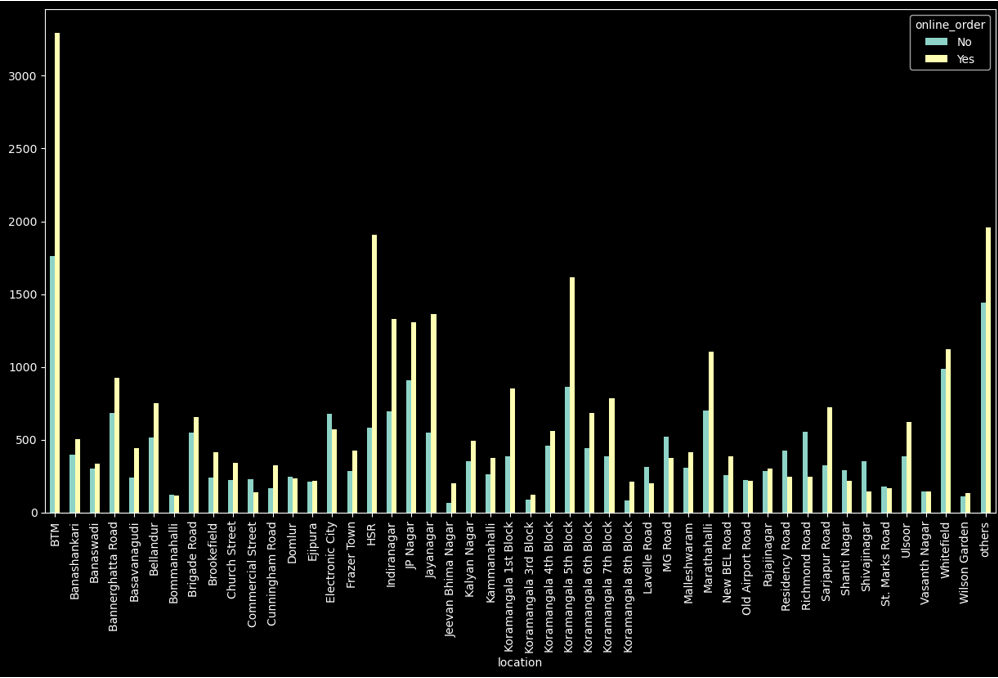
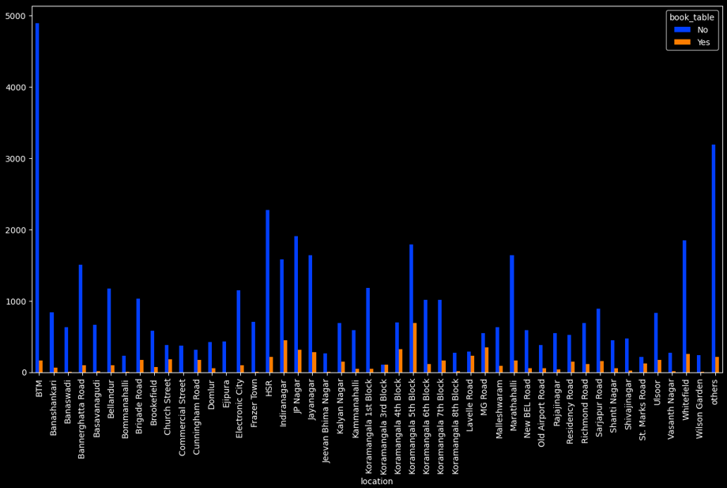
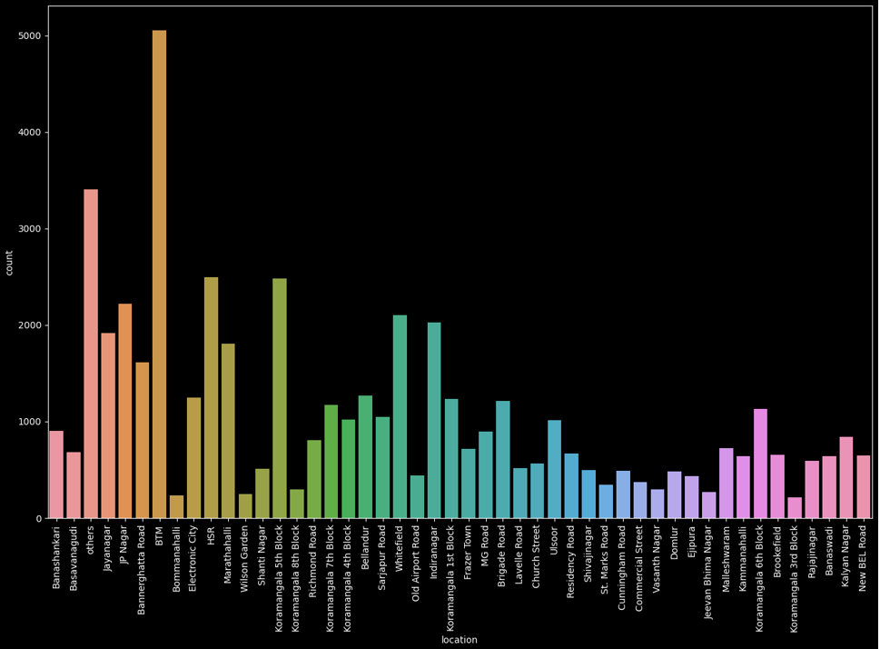
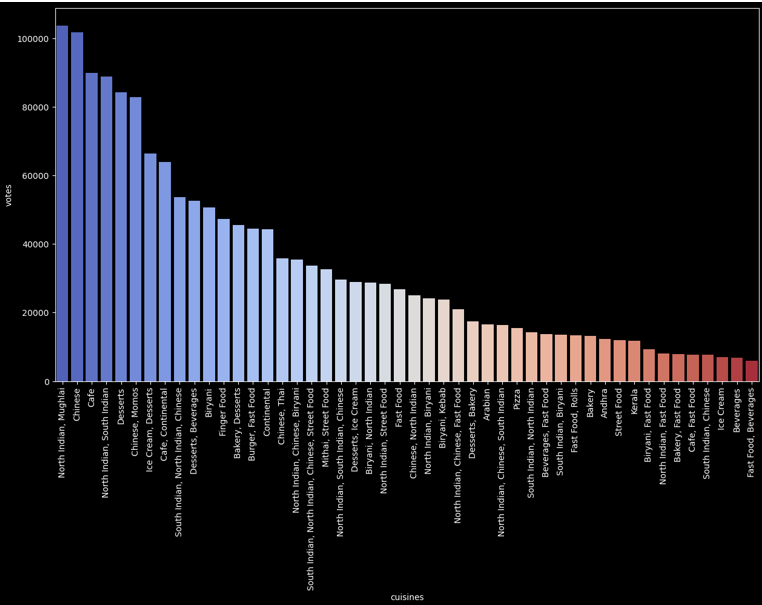
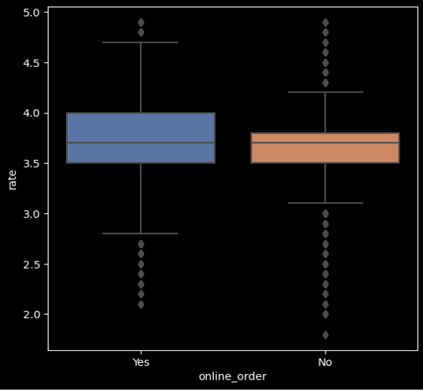
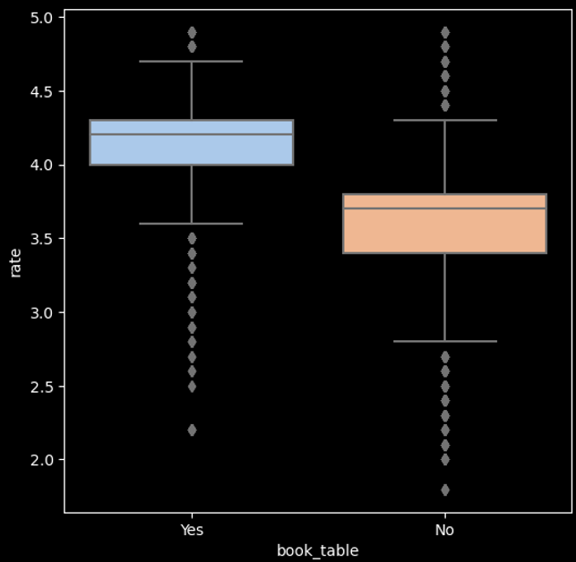

# EDA on Food Delivery Data
These are data analysis projects conducting EDA and implementing usecase scenarios for respective Datas,also depicting the usage of EDA cycle for the visualisation and further improvement of product services by enhanced visualisation and conclusions from it.
# Food Delivery Dataset Analysis

## Overview
The **Food Delivery Dataset Analysis** project aims to explore and analyze a comprehensive dataset from a prominent food delivery platform to uncover valuable insights and trends within the industry. With the rapid growth of the food delivery market, understanding customer preferences, delivery patterns, and other critical aspects becomes pivotal for improving service efficiency and customer satisfaction.

This research utilizes a diverse dataset encompassing customer information, order details, delivery routes, restaurant data, and feedback ratings. Leveraging advanced data analytics techniques, we analyze the dataset to identify key factors that influence user behavior, popular cuisines, peak ordering hours, delivery times, and customer satisfaction levels. Data visualization provides a quick and effective way to communicate information in a universal manner using visual information.

## Introduction
The rise of online platforms has revolutionized the way people order and enjoy food. Food delivery services have emerged as a dominant force in the food industry, offering convenience and a diverse range of culinary options to consumers. The **Food Delivery Dataset Analysis** project aims to leverage this wealth of data to gain deeper insights into the dynamics of the food delivery market.

By exploring and analyzing a comprehensive dataset from a prominent food delivery platform, we seek to uncover hidden patterns, trends, and correlations that can lead to informed decision-making and improvements in service quality. With the ever-increasing popularity of food delivery platforms, an immense amount of data is generated daily, encompassing crucial information about customer behavior, restaurant performance, delivery logistics, and overall service efficiency.

## Methodology

### 1. Dataset Collection
The dataset used in this project is **Zomato.csv**, which contains multiple columns, such as:
- url
- address
- name
- online order
- book table
- rate
- votes
- phone
- location
- rest type
- dish liked
- approx cost (for two people)
- reviews list
- menu item
- listed in (type)
- listed in (city)

The dataset is imported into Jupyter Notebook using the `read_csv()` method in pandas.

### 2. Data Preprocessing
This step involves several tasks aimed at cleaning, transforming, and organizing the data to improve its quality, relevance, and suitability for the specific analysis:
- Convert Rating into a float value by removing “/5”.
- Drop duplicates and unnecessary columns (like `url`, `listed_in(city)`).
- Rename locations, rest_types, and cuisines with less than considerable values to "others" for easy evaluation.
- Handle missing values using `isnull()` and drop them with `dropna()`.

### 3. Query Resolution
Query resolution is essential for addressing questions or inquiries about the data. The following methods are used for efficient analysis:
- **groupby()**: Groups data based on one or more categorical variables, allowing aggregate functions.
- **sort_values()**: Sorts rows based on categorical or numerical data to identify patterns.
- **value_counts()**: Provides the frequency of unique values in each column.

Some resolved queries include:
- What type of dishes are most popular and liked by customers?
- Which locations are most suitable for establishing a new restaurant?
- What restaurant facilities improve ratings?
- How to change the menu to manage large orders during peak times?

### 4. Data Visualization
Data visualization is a key component of this project, providing graphical representations of data. The following visualizations were created:

- **Bar graphs**: Used to represent frequency or counts of categories (e.g., online orders, restaurant locations).
  
  
  
- **Count plots**: Display counts of categorical variables (e.g., restaurant locations, vote counts).
  
  
  
  
- **Box plots**: Show distributions, outliers, and spread of data (e.g., restaurant ratings by facilities like online orders and book tables).
  
  
  

Visualization libraries used:
- **Matplotlib**
- **Seaborn**

### 5. Behavior Analysis
Behavior analysis provides insights into user behavior, preferences, and trends:
- North Indian and Mughlai dishes are the most popular.
- Book Table facilities positively impact restaurant ratings.
- Restaurants offering online order services tend to have higher ratings.
- Buffet, Bar, and Nightclub types achieve the highest average ratings.
- For new restaurant owners, choosing locations with fewer competitors and offering online order and book table facilities is crucial.

## Conclusion
The **Food Delivery Dataset Analysis** has provided valuable insights that can guide strategic decision-making, improve customer satisfaction, and drive sustainable growth for the food delivery platform. By leveraging these insights, the platform can maintain a competitive edge in the dynamic food delivery market.

The analysis also revealed promising market opportunities, highlighting untapped areas with high demand for food delivery services. These opportunities provide avenues for strategic expansion and increased market share.

